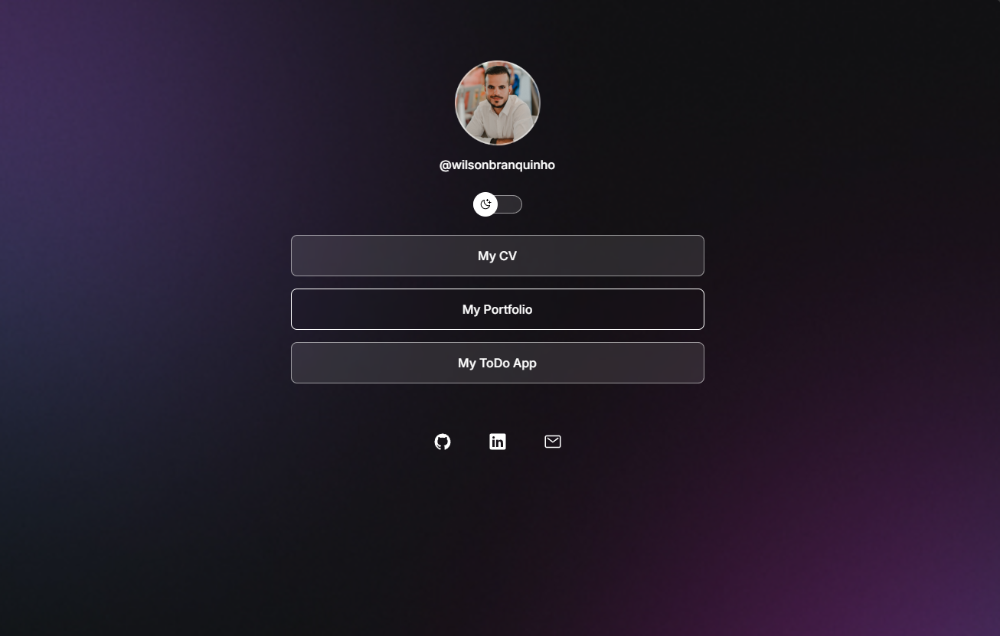

<h1 align="center"> DevLinks </h1>

DevLinks is a link aggregator to use as an online business card. Here you can find my contacts, my CV and my social networks. Feel free to contact me and follow me on social networks. I'm always open to new opportunities and partnerships. Let's talk! 🚀

 

  <a href="#-technologies">Technologies</a>&nbsp;&nbsp;&nbsp;|&nbsp;&nbsp;&nbsp;
  <a href="#-project">Project</a>&nbsp;&nbsp;&nbsp;|&nbsp;&nbsp;&nbsp;

 

  

## 🚀 Technologies

This project was developed with the following technologies:

- HTML
- CSS
- JavaScript
- Figma

## 💻 Project

- [Access the completed project online](https://branco95.github.io/devlinks)

